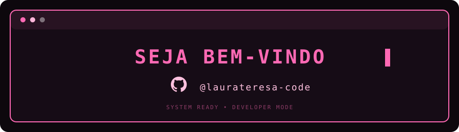

<div align="center">
  
</div>


```text
 Desenvolvedora de Sistemas • Full Stack • Tecnologia aplicada a problemas reais
```

Sou desenvolvedora e analista de sistemas, meu objetivo principal é construir aplicações que vão além de uma interface bonita, crio projetos que resolvem problemas reais, organizam processos e tornam o trabalho mais simples. 

Tenho experiência prática com desenvolvimento web, APIs, bancos de dados, aplicações mobile, integrações e automações. Também venho explorando inteligência artificial e visão computacional para deixar meus projetos cada vez mais funcionais e didáticos para os meus clientes.


## ୨୧ Meus objetivos como desenvolvedora ୨୧

<p>⟡  Transformar requisitos em soluções práticas</p>
<p>⟡  Investigar problemas e encontrar a causa raiz</p>
<p>⟡ Considerar a experiência em diferentes dispositivos</p> 
<p>⟡  Automatizar processos repetitivos</p>
<p>⟡  Aplicar o conhecimento em projetos reais</p>

---

## ୨୧ GitHub ୨୧

Aqui você encontra projetos, experimentos e aplicações desenvolvidas ao longo da minha evolução profissional.

Alguns projetos são privados por fazerem parte de sistemas internos terceiros e produtos em desenvolvimento.

---

## ୨୧ Vamos conversar? ୨୧

Se quiser trocar uma ideia sobre desenvolvimento, tecnologia ou algum projeto, fique à vontade para entrar em contato.

<div align="center">

[](https://github.com/laurateresa-code)
[](mailto:laurateresajpereira@gmail.com?subject=Contato%20pelo%20GitHub)
[](https://wa.me/5531998411846?text=Ol%C3%A1%2C%20Laura%21%20Encontrei%20seu%20perfil%20no%20GitHub%20e%20gostaria%20de%20conversar.)

</div>

---

<p align="center">
  <sub>Feito com 🩷 por Laura Teresa</sub></p>
  

